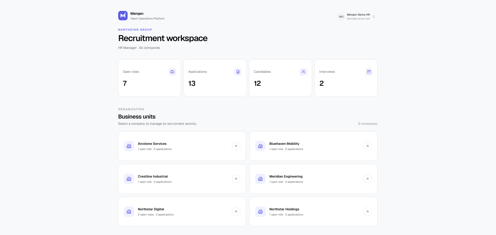
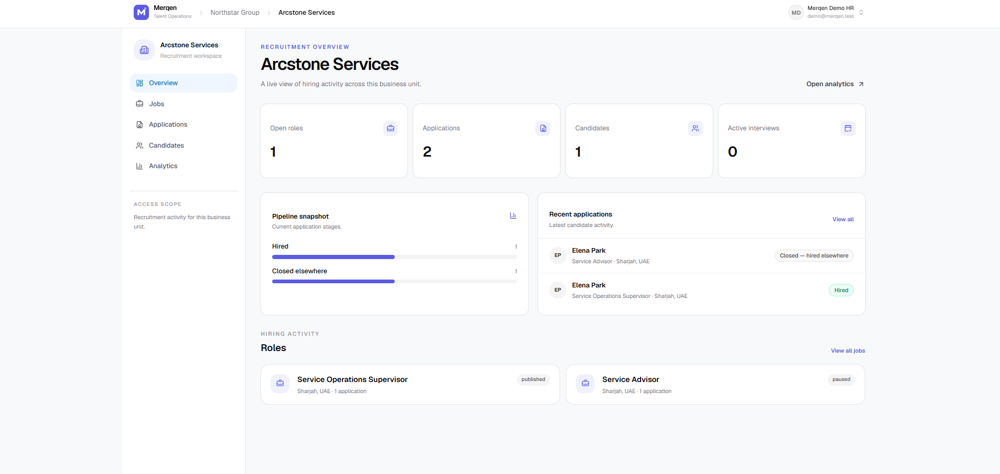
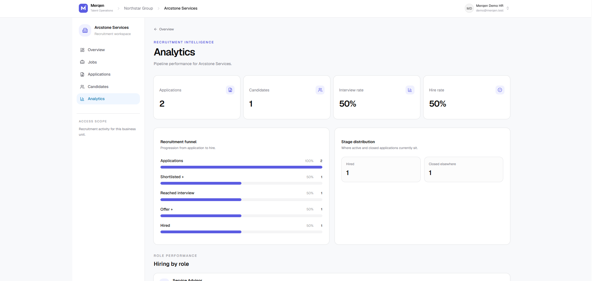
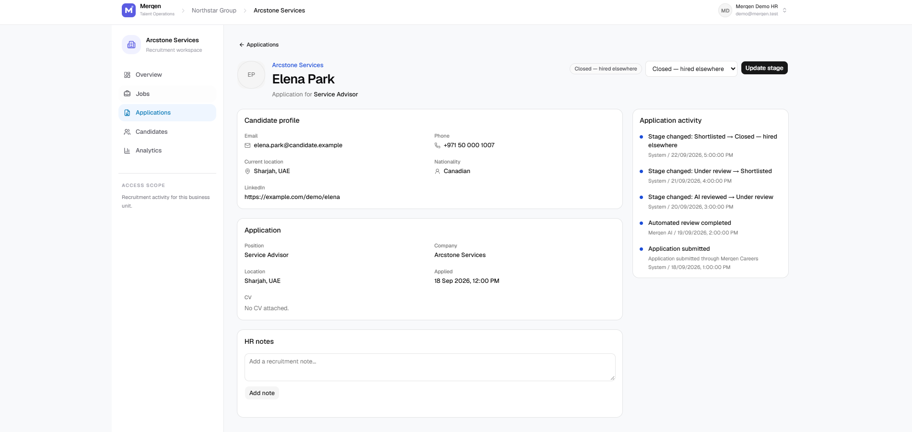
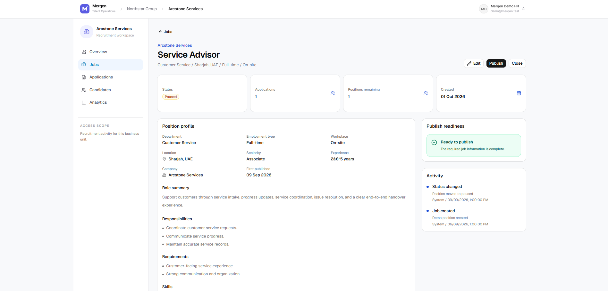
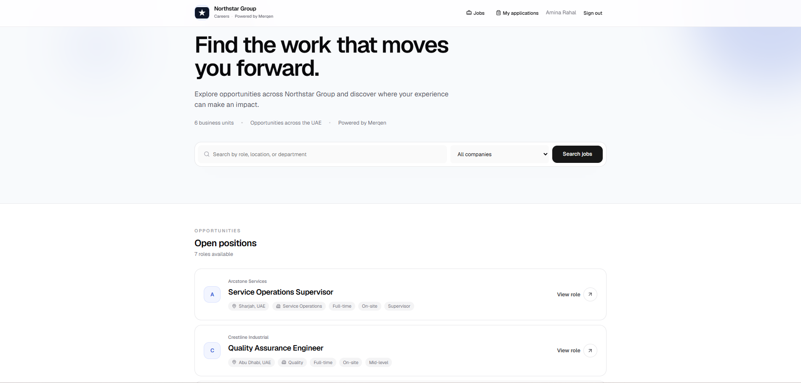
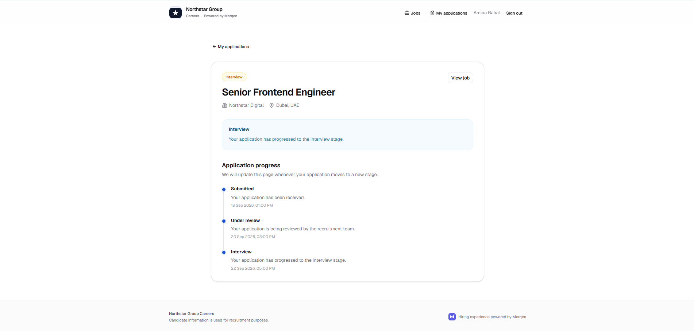

# Merqen

### Talent Operations Platform

**Hiring operations, connected.**

Merqen is a multi-tenant recruitment platform that connects candidate-facing hiring experiences with internal recruitment operations across multiple companies and business units.

> This repository is a public engineering showcase. The complete application core is maintained separately and is not published here.

---



---

## What Merqen Solves

Recruitment operations often become fragmented across job listings, spreadsheets, candidate files, emails, notes, and disconnected hiring stages.

Merqen brings those workflows into one structured platform:

- Multi-company recruitment workspace
- Candidate careers portal
- Job lifecycle management
- Structured application pipeline
- Candidate profiles and CV handling
- Screening questions
- Recruitment analytics
- Role-based access control
- Company and job access scopes
- Audit-oriented activity history
- Candidate communication workflow

---

## Product Tour

### Recruitment Operations

Recruiters start from a tenant-wide workspace with hiring metrics and business-unit visibility.



### Recruitment Intelligence

Pipeline metrics show application progression, interview reach, hiring outcomes, and stage distribution.



### Application Decision Workspace

Candidate information, application context, stage control, HR notes, and structured activity history are available in one decision surface.



### Job Operations

Jobs have lifecycle state, application counts, structured position data, activity history, and publish-readiness rules.



### Candidate Experience

The candidate-facing experience is separated from the internal recruitment workspace while sharing the same underlying recruitment domain.



Candidates can follow their application without exposing internal recruitment stages or operational notes.



The complete screenshot set is available in [`docs/screenshots`](docs/screenshots).

---

## Architecture

Merqen uses a tenant-aware application architecture built around explicit recruitment domain rules.

```text
Candidate Experience
        |
        v
     Careers
        |
        +----------------------+
                               |
Recruitment Workspace          |
        |                      |
        v                      v
 Authorization + Recruitment Domain
        |
        +-- Jobs
        +-- Candidates
        +-- Applications
        +-- Screening
        +-- Analytics
        +-- Audit Events
        +-- Email Outbox
        |
        v
      Prisma
        |
        v
    PostgreSQL
```

### Technology

- Next.js 16
- React 19
- TypeScript
- PostgreSQL
- Prisma 7
- Better Auth
- Tailwind CSS 4
- shadcn/ui
- Radix UI
- TanStack Table
- Nodemailer
- Docker
- GitHub Actions

Read the architecture overview: [`docs/architecture.md`](docs/architecture.md)

---

## Access Model

Merqen does not rely on a single broad admin/user distinction.

Internal access can combine:

- Tenant membership
- Recruitment role
- Granular permission grants
- All-company scope
- Selected-company scope
- Assigned-job scope

Candidate authorization is modeled separately from staff authorization.

Read more: [`docs/security-model.md`](docs/security-model.md)

---

## Recruitment Workflow

```text
Applied
  ↓
AI Reviewed
  ↓
HR Review
  ↓
Shortlisted
  ↓
Interview
  ↓
Final Interview
  ↓
Offer
  ↓
Hired
```

Additional controlled states include:

`On Hold` · `Talent Pool` · `Rejected` · `Withdrawn` · `Closed — Hired Elsewhere`

Application lifecycle transitions are validated at the domain layer rather than being unrestricted status updates.

Read the product flow: [`docs/product-flow.md`](docs/product-flow.md)

---

## Selected Engineering Samples

The public repository contains curated excerpts rather than the complete private application source.

| Area | Engineering concept |
| --- | --- |
| [Access policy](samples/01-access-policy.md) | Tenant, company, and assigned-job authorization |
| [Application workflow](samples/02-application-workflow.md) | Controlled recruitment stage transitions |
| [Job readiness](samples/03-job-publish-readiness.md) | Domain-level publishing requirements |
| [Email outbox](samples/04-email-outbox.md) | Milestone communication and duplicate prevention |

Additional design context: [`docs/engineering-decisions.md`](docs/engineering-decisions.md)

---

## Demo Dataset

The showcase uses the fictional **Northstar Group** organization.

The demo environment contains:

- 6 business units
- 9 jobs
- 12 candidates
- 13 applications
- Multiple recruitment stages
- Screening responses
- Job and application events
- Email history
- Talent-pool records

All organizations, identities, contact details, candidates, and recruitment records shown here are synthetic.

---

## Live Demo

**Deployment in progress.**

The hosted portfolio environment will provide separate recruiter and candidate demo experiences.

---

## Repository Scope

This repository intentionally contains:

- Product screenshots
- Architecture documentation
- Product-flow documentation
- Security-model overview
- Engineering decisions
- Selected code excerpts

It intentionally does **not** publish the complete Merqen application core.

---

## Project Status

**Advanced pre-production portfolio project**

The project demonstrates full-stack product engineering, multi-tenant architecture, authorization design, recruitment-domain modeling, workflow validation, and candidate-facing product development.

---

## Source Usage

Published for portfolio review and technical evaluation.

The project is not distributed under an open-source license. See [`LICENSE`](LICENSE).
